# Manual Técnico

## Tabla Resumen
| Nivel |           Área         |  Dirección IP     | Máscara       
|-------|------------------------|-------------------|---------------
| 1     | Administración         | 192.168.14.13     | 255.255.255.0 |
| 1     | Gerencia               | 192.168.14.11     | 255.255.255.0 |
| 1     | Secretaria de gerencia | 192.168.14.12     | 255.255.255.0 |
| 1     | Atención al cliente    | 192.168.14.14     | 255.255.255.0 |
| 1     | Atención al cliente    | 192.168.14.15     | 255.255.255.0 |
| 1     | Recursos humanos       | 192.168.14.16     | 255.255.255.0 |
| 1     | Recursos humanos       | 192.168.14.17     | 255.255.255.0 |
| 1     | Recursos humanos       | 192.168.14.18     | 255.255.255.0 |
| 1     | Recursos humanos       | 192.168.14.19     | 255.255.255.0 |
| 1     | Recursos humanos       | 192.168.14.110    | 255.255.255.0 |
| 1     | Recursos humanos       | 192.168.14.111    | 255.255.255.0 |
| 2     | Oficina A              | 192.168.14.21     | 255.255.255.0 |
| 2     | Oficina A              | 192.168.14.22     | 255.255.255.0 |
| 2     | Oficina A              | 192.168.14.23     | 255.255.255.0 |
| 2     | Oficina B              | 192.168.14.24     | 255.255.255.0 |
| 2     | Oficina B              | 192.168.14.25     | 255.255.255.0 |
| 2     | Oficina B              | 192.168.14.26     | 255.255.255.0 |
| 2     | Oficina B              | 192.168.14.27     | 255.255.255.0 |
| 2     | Oficina B              | 192.168.14.28     | 255.255.255.0 |
| 2     | Oficina B              | 192.168.14.29     | 255.255.255.0 |
| 2     | Oficina C              | 192.168.14.210    | 255.255.255.0 |
| 2     | Oficina C              | 192.168.14.211    | 255.255.255.0 |
| 2     | Oficina C              | 192.168.14.212    | 255.255.255.0 |
| 3     | Recepción              | 192.168.14.31     | 255.255.255.0 |
| 3     | TI                     | 192.168.14.32     | 255.255.255.0 |
| 3     | TI                     | 192.168.14.33     | 255.255.255.0 |
| 3     | TI                     | 192.168.14.34     | 255.255.255.0 |
| 3     | Ventas                 | 192.168.14.35     | 255.255.255.0 |

## Configuración de las VPCs (por área)
Para cada área, se debe configurar la dirección IP correspondiente según la red `192.168.14.x0`, donde `x` es el número de nivel al que pertenece. A continuación, se describen los pasos para configurar una VPC:

**Configurar la IP**
    - **Paso 1:** Seleccionar la VPC a configurar y acceder a la pestaña `Desktop`.
      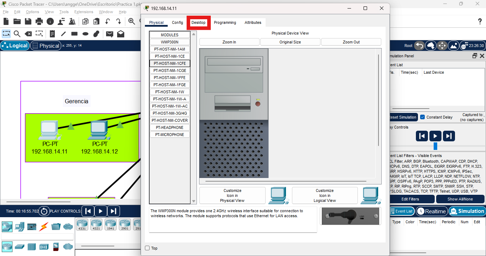
    - **Paso 2:** Seleccionar `IP Configuration`.
      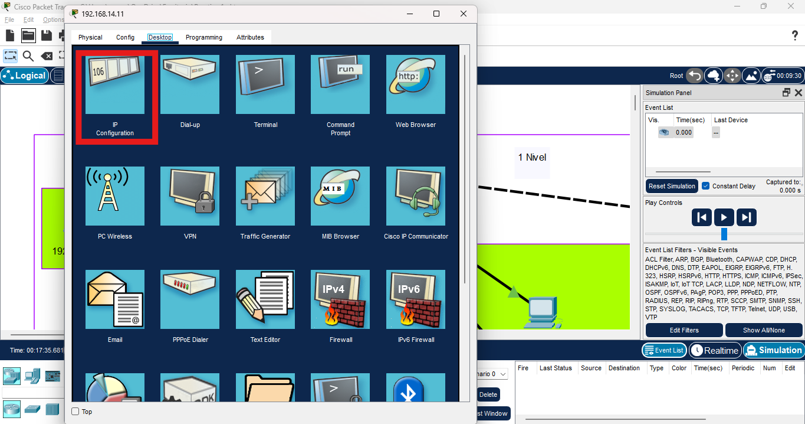
    
   ***Gerencia - Primer Nivel***
    Para Gerencia en el primer nivel se configuraron 3 áreas:
    - **VPC en Administración:**
     Se ingresó la dirección IP basada en el formato `192.168.14.x0`. En este caso, por ser del primer nivel, sería `192.168.14.13` con una máscara de subred `255.255.255.0`.
    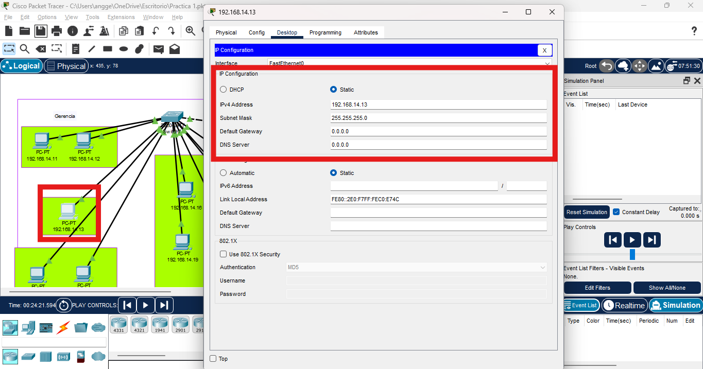
     **VPC en Gerencia y secretaria:**
    Se ingresó la dirección IP basada en el formato `192.168.14.x0`. En este caso, sería `192.168.14.11` hasta la `192.168.14.12` con una máscara de subred `255.255.255.0`.
    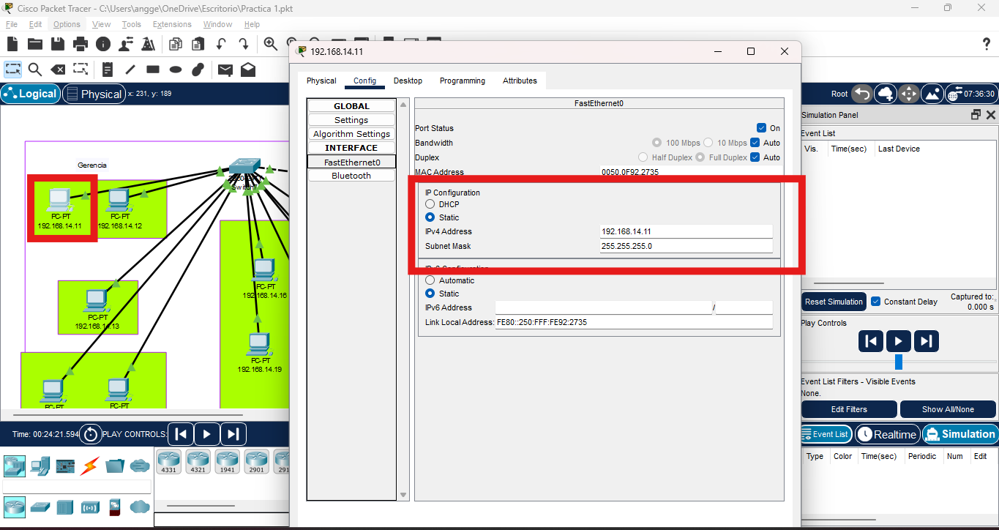
    - **VPC para Atención al Cliente:**
    Se ingresó la dirección IP basada en el formato `192.168.14.x0`. En este caso, sería `192.168.14.14` hasta la `192.168.14.11` con una máscara de subred `255.255.255.0`.
    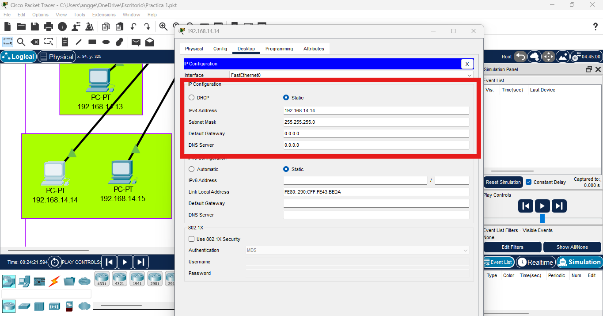
    - **VPC para Recursos Humanos:**
      Se ingresó la dirección IP basada en el formato `192.168.14.x0`. En este caso, sería `192.168.14.16` hasta la `192.168.14.111` con una máscara de subred `255.255.255.0`.
    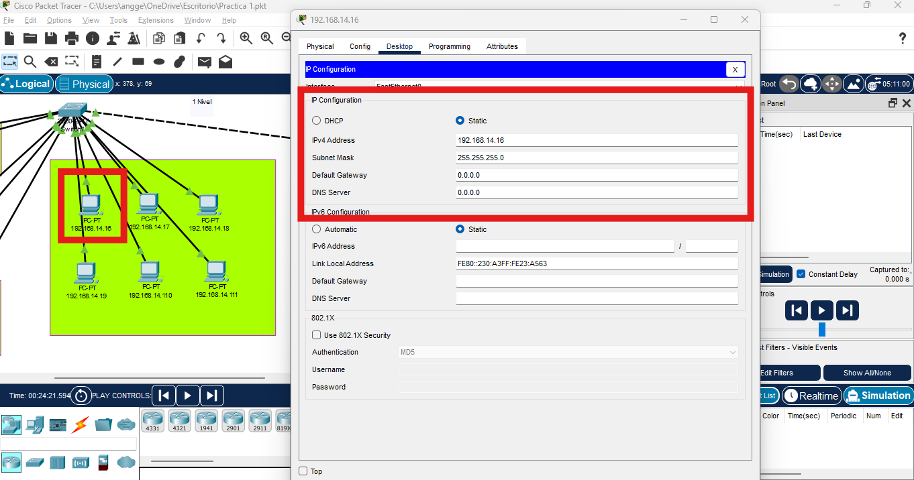

***Segundo Nivel***
    - **VPC para Oficina A:**
    Se ingresó la dirección IP basada en el formato `192.168.14.x0`. En este caso, sería `192.168.14.21` hasta la `192.168.14.23` con una máscara de subred `255.255.255.0`.
        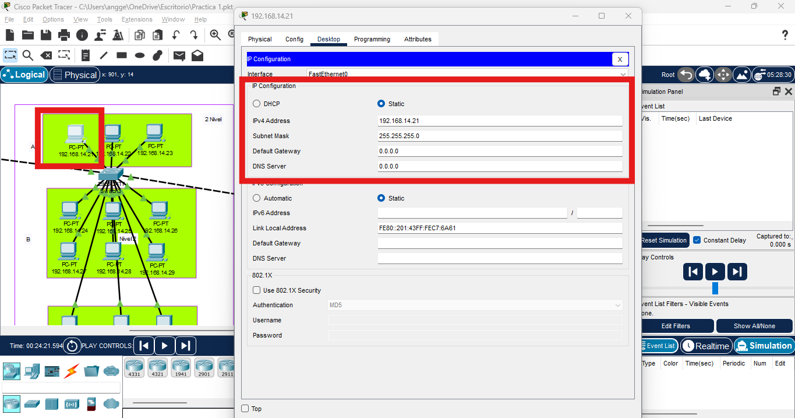
    - **VPC para Oficina B:**
    Se ingresó la dirección IP basada en el formato `192.168.14.x0`. En este caso, sería `192.168.14.24` hasta la `192.168.14.29` con una máscara de subred `255.255.255.0`.
        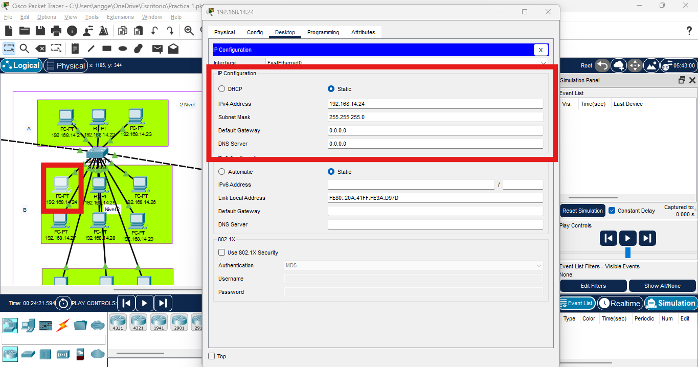
    - **VPC para Oficina C:**
    Se ingresó la dirección IP basada en el formato `192.168.14.x0`. En este caso, sería `192.168.14.210` hasta la `192.168.14.212` con una máscara de subred `255.255.255.0`.
        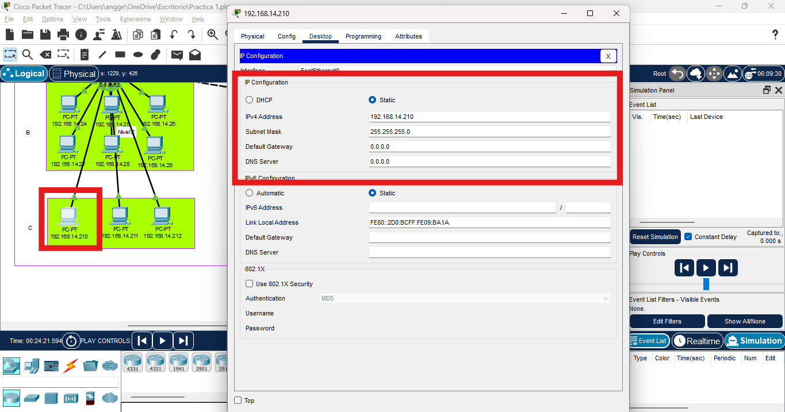

***Tercer Nivel***
    - **VPC para Recepción:**
    Se ingresó la dirección IP basada en el formato `192.168.14.x0`. En este caso, sería `192.168.14.31` con una máscara de subred `255.255.255.0`.
    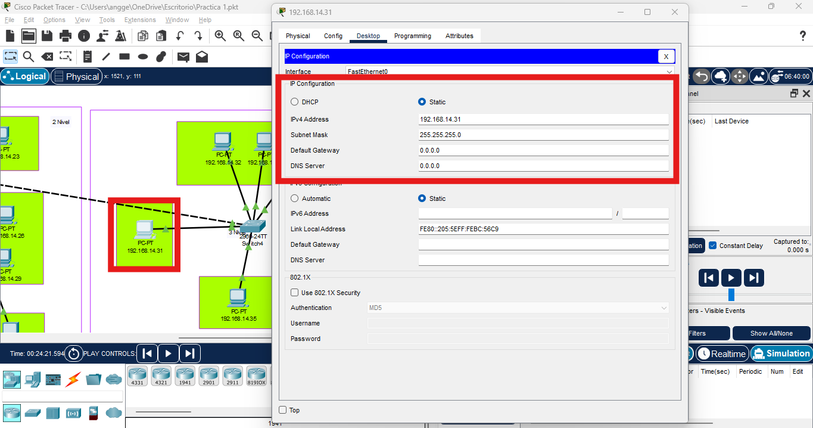
    - **VPC para TI:**
    Se ingresó la dirección IP basada en el formato `192.168.14.x0`. En este caso, sería `192.168.14.32` hasta la `192.168.14.34` con una máscara de subred `255.255.255.0`.
        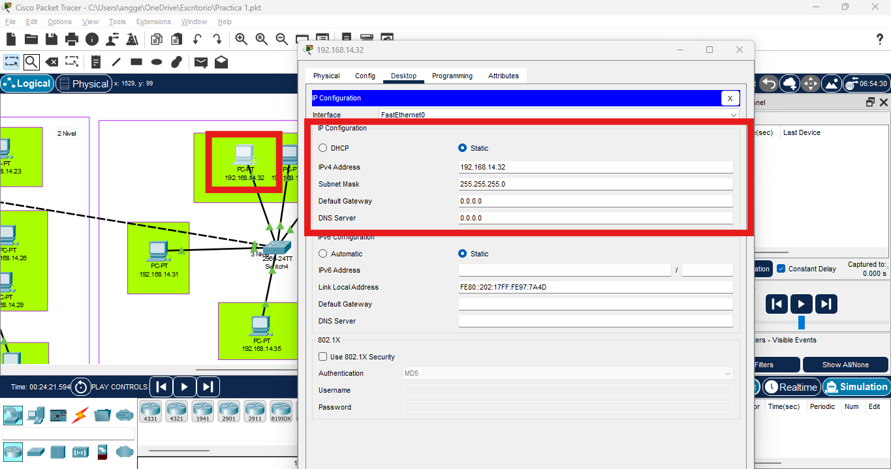
    - **VPC para Ventas:**
    Se ingresó la dirección IP basada en el formato `192.168.14.x0`. En este caso, sería `192.168.14.35` con una máscara de subred `255.255.255.0`.
    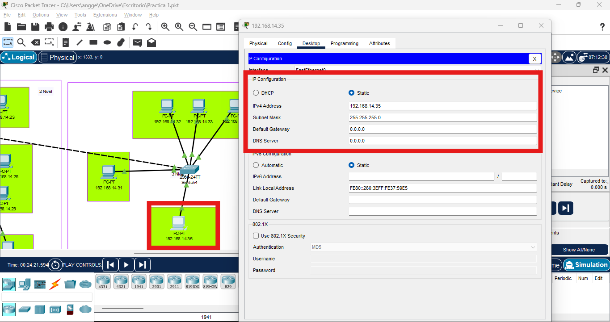

## Pings entre los hosts
Para verificar la comunicación entre las áreas, se realizarán pings desde una VPC a otra en distintas áreas.
**1.**
Se realizo un ping del area del atencion del cliente cuyo ip es 192.168.14.15 hacia el area de recusso humanos cuyo ping 192.168.14.111
   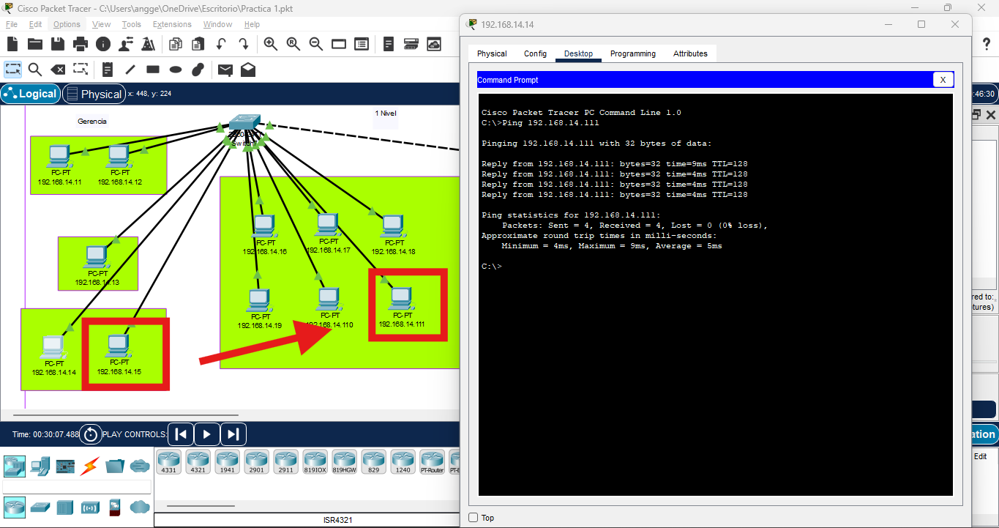
**2.**
Se realizo un ping del area de recusso humanos cuyo ip es 192.168.14.17 hacia el area de oficina B cuyo ping 192.168.14.24
   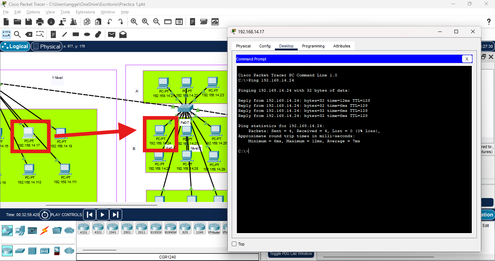
**3.**
Se realizo un ping del area de oficinas C cuyo ip es 192.168.14.211 hacia el area de oficina A cuyo ping 192.168.14.23
   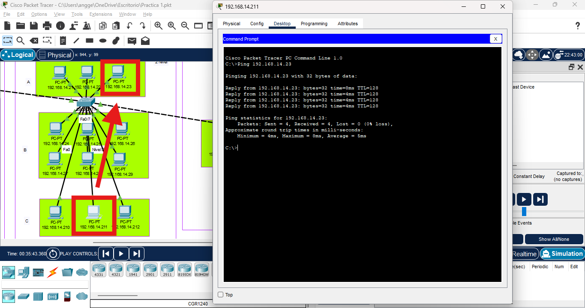
**4.**
Se realizo un ping del area de TI cuyo ip es 192.168.14.34 hacia el area de oficina B cuyo ping 192.168.14.28
   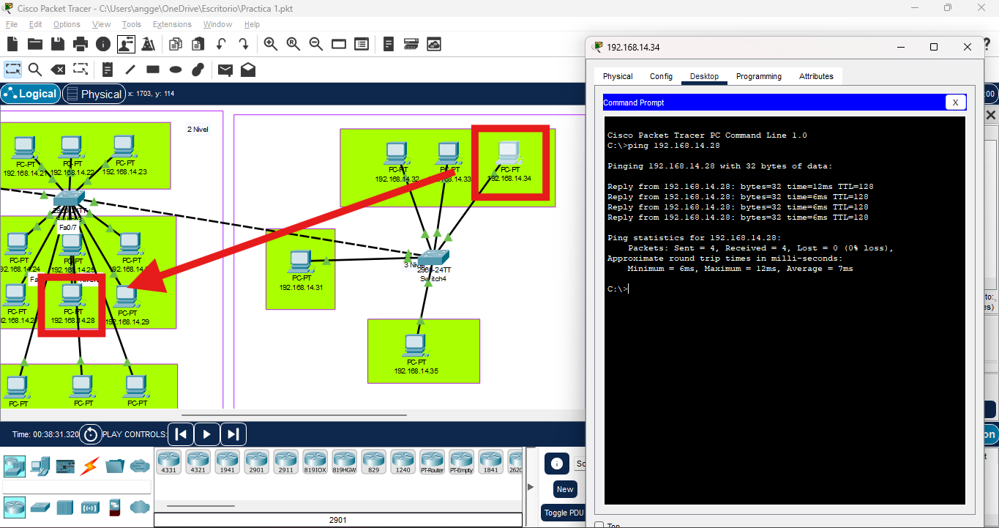
**5.**
Se realizo un ping del area de administración cuyo ip es 192.168.14.13 hacia el area de recepcion cuyo ping 192.168.14.31
   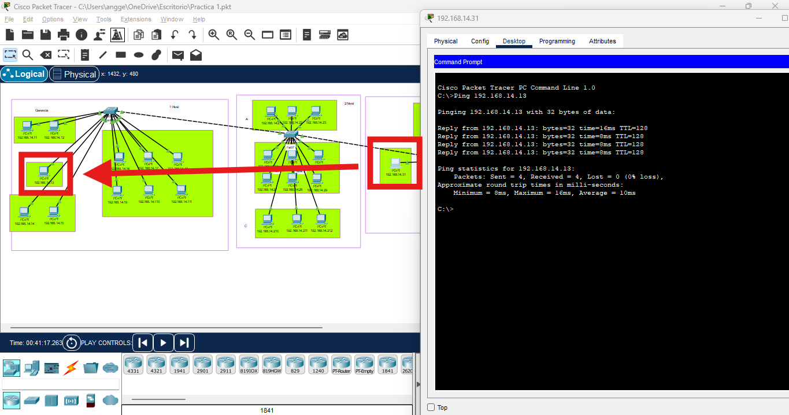

## Captura de Paquete ARP/ICMP
Para la demostración de la captura de paquetes, se realizará una captura de un paquete ICMP utilizando el modo simulación de Packet Tracer enviando un paquete desde 192.168.14.35 a 192.168.14.27
   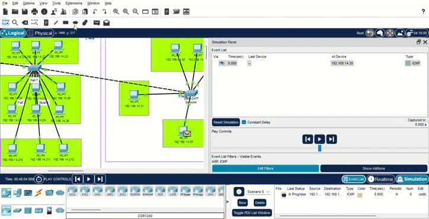
