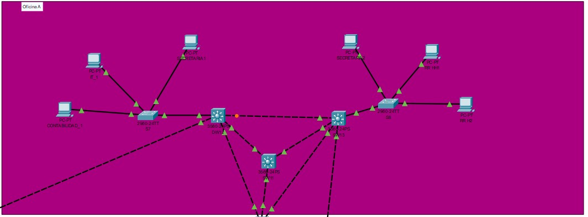
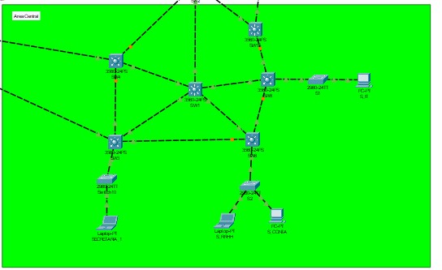
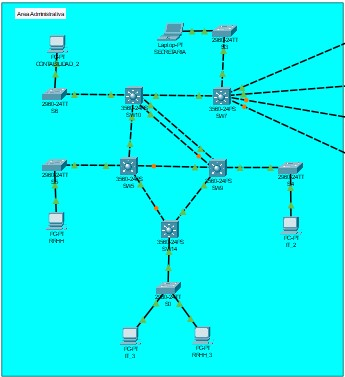
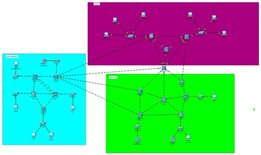
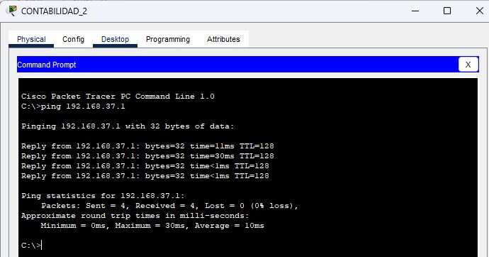
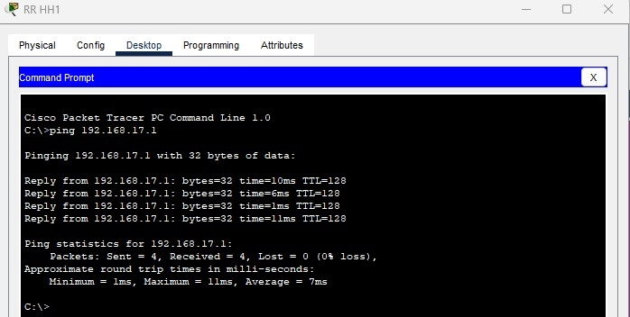

# Manual Técnico

## Tabla Resumen
| Area  |           Departamento             |  Dirección IP     | Máscara       |  Vlan
|-------|------------------------------------|-------------------|---------------|----------
| Oficina A         | Secretaria 1           | 192.168.27.1      | 255.255.255.0 | 27       |
| Oficina A         | IT_1                   | 192.168.47.1      | 255.255.255.0 | 47       |
| Oficina A         | Contabilidad_1         | 192.168.37.2      | 255.255.255.0 | 37       |
| Oficina A         | Secretaria2            | 192.168.27.2      | 255.255.255.0 | 27       |
| Oficina A         | RR HH1                 | 192.168.17.1      | 255.255.255.0 | 17       |
| Oficina A         | RR HH2                 | 192.168.17.2      | 255.255.255.0 | 17       |
| Central           | S_IT                   | 192.168.47.2      | 255.255.255.0 | 47       |
| Central           | S_Conta                | 192.168.37.1      | 255.255.255.0 | 37       |
| Central           | S_RRHH                 | 192.168.17.3      | 255.255.255.0 | 17       |
| Central           | Secretaria_1           | 192.168.27.3      | 255.255.255.0 | 27       |
| Administrativa    | Secretaria             | 192.168.27.10     | 255.255.255.0 | 27       |
| Administrativa    | Contabilidad_2         | 192.168.37.20     | 255.255.255.0 | 37       |
| Administrativa    | RRHH                   | 192.168.17.10     | 255.255.255.0 | 17       |
| Administrativa    | IT_2                   | 192.168.47.20     | 255.255.255.0 | 47       |
| Administrativa    | IT_3                   | 192.168.47.30     | 255.255.255.0 | 47       |
| Administrativa    | RRHH_3                 | 192.168.17.30     | 255.255.255.0 | 17       |


## Implementación de las topologías

**Oficina A**     



**Area Central**        



**Area Administrativa**  



**Topologia**           




## Detalle de los comandos usados

### SWITCH ROOT

Se configuró el switch SW1 como Server y Root.
```
    conf t 
    vtp domain g18
    vtp password usac
    vtp version 2 
    vtp mode server
```

Configurar VLANS
```
    conft t
    vlan 17
    name RRHH
    exit 
    vlan 27
    name Secretaria
    exit 
    vlan 37
    name Contabilidad
    exit 
    vlan 47
    name IT
    exit 
```

Configuración de los puertos en modo trunk y envio de las VLANs para todos los switchs.
en switch root
```
    int range f0/20-24
    switchport mode trunk
    switchport trunk allowed vlan 1,17,27,37,47,1002-1005
```

Se configuran las VLAN para que pertenezcan al Root Bridge para el switch root.
vlan root
```
conf t
    spanning-tree vlan 17 root primary
    spanning-tree vlan 27 root primary
    spanning-tree vlan 37 root primary
    spanning-tree vlan 47 root primary
```

Configuración de los switches todos los demas switches en modo cliente
Client
```
    conf t  
    vtp domain g18
    vtp password usac
    vtp version 2 
    vtp mode client
```

Configuración de los puertos en modo access para dispositivos finales
```
    int f0/10
    switchport mode access
    switchport access vlan 47
```
## Ping entre hosts
Para la demostración de ping, se realizara en: 
- desde 192.168.37.20 a 192.168.37.1

- desde 192.168.17.1 a 192.168.17.10

